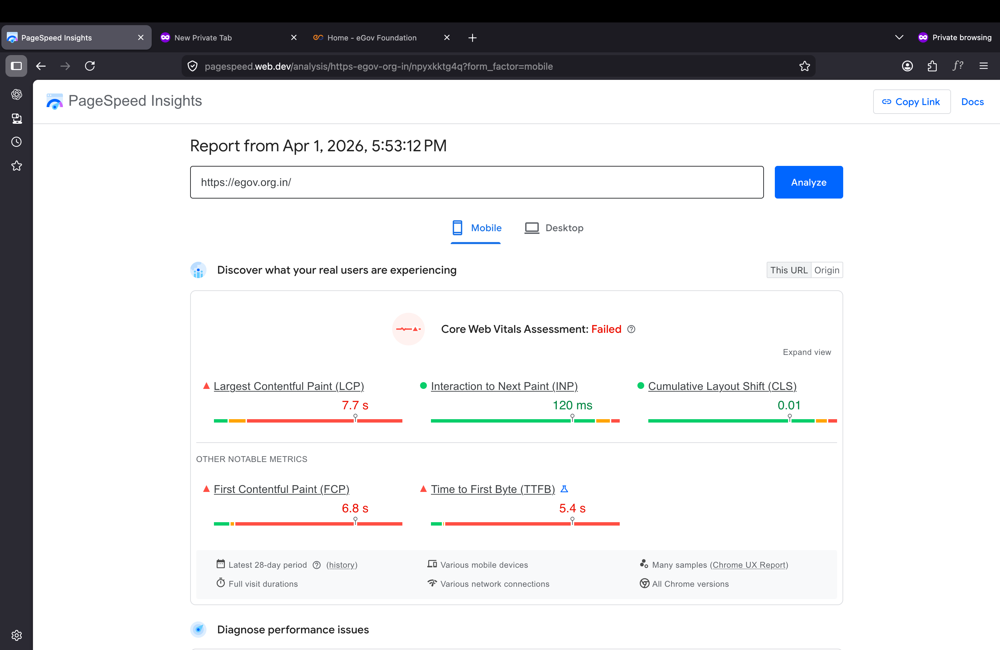

# Tailwebs Task Submission — Shiva Kumar

## 🔍 Initial Observation (egov.org.in)

* Checked **egov.org.in** PageSpeed performance
* Observed **very low performance score**
* Large image sizes affecting load time
* Render blocking resources
* Layout shifts impacting user experience
* Optimization opportunities available

📷 *PageSpeed screenshots attached for reference*

---

## ✅ My Approach

* Focused on performance improvements
* Clean and scalable UI structure
* Better responsive layout
* Optimized implementation

---

## ✅ Completed Work

**Task 1** — HTML, CSS, Bootstrap

* Responsive layout
* Clean UI
* Optimized structure

**Task 2** — React Version

* Component-based architecture
* Reusable components
* Clean folder structure

---

## ⭐ Extra Work (Beyond Task)

* Added **Enhanced UI version** from my side
* Improved layout and user experience

---

## 📈 SEO & Performance

* Basic SEO knowledge
* Completed SEO courses
* Can further improve performance & Core Web Vitals

---

## ⏱️ Note

* Completed within short time
* Was not feeling well but ensured timely delivery
* Can further enhance with more time

---

## Why Consider Me

* 2.5+ years experience
* Strong HTML, CSS, Bootstrap, React
* Performance-focused development
* Fast learner & proactive

---

**Shiva Kumar**
Front-End Developer
